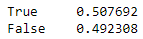

# Fantasy Football Manager Rating

## Inspiration:
I’ve noticed, in my years of competing in fantasy football, that the same handful of managers tend to be at the top of the league every year. Although luck certainly plays its part in the outcomes of matchups, in my observation, success in fantasy football is highly correlated with the skill on the manager. And the US agrees with my observation, fantasy football has been legal in the country due to skill component even when sports betting was overwhelmingly illegal. The equation I came up with attempts to mitigate one specific factor of luck in fantasy football by weighing both performance vs opponent and performance vs median score of the league participants in that week. Opponent performance is something a manager has no control over, so taking performance vs median into account is a crucial part of my equation. It would be difficult to argue that a manager who consistently scores below the median and takes advantage of an easy schedule is somehow better than a manager that consistently scores above the median and is burdened with tough matchups. As for the importance of performance vs opponent, I have another example. Take, for instance, a manager who knows they are projected to lose their matchup. This manager will likely start a more volatile option who has the potential to “boom” than a consistent option who doesn’t have a “boom” in their range of outcomes. Additionally, the ultimate goal for a manager is to win their matchup, so this must be a point of emphasis in the model.

## Challenges:
I collected and inputted all the data for this project manually into excel, which proved to be time-consuming. Additionally, I had to manually change each formula to calculate the correct Elo based on each matchup, which required a large amount of patience and attention to detail. I believe I could make the collection and calculation process much easier with a better understanding of python and API’s. I hope to rebuild this project in a more efficient way in the future.

## Equations:
Elo vs opponent:

Elo vs median:

Manager Rating:

The original equation that I started with equally weighs Elo for the performance vs opponent and performance vs median (above), so the formula was just the basic average of the two ratings(α=0.5). I decided to write the equation in a more general form with α being the determining factor for the weight. I believe the optimal α will be between 0.15 and 0.35, which would mean performance vs median is much more indicative of success than performance vs opponent.  

Mean Regression Rate:

In this equation, β is a value between 0 and 1 that regresses each rating to the mean at the beginning of each season. I got this idea from FiveThirtyEight’s NFL game predictions.

https://fivethirtyeight.com/methodology/how-our-nfl-predictions-work/

The NFL model has a mean regression rate of 1/3, fantasy football is much more volatile because each team is completely wiped out each after each season. I believe the optimal β value will be somewhere between 0.5 and .75 due to the high volatility.

## Results:
The initial hypothesized equation consisted of an equal weighing of performance equally and a .5 mean regression rate, i.e., α=0.5, β=0.5 (See ELO.5mrr.ipynb for full details). I decided to omit the first 3 weeks of season 1 so that the rating could at least slightly reflect manager skill. Next to true, is the rate at which the higher rated manager won their matchup. Next to false, is the rate at which the lower rated manager won their matchup.

Full Accuracy:

 
Season 1: (50 games)

 
Season 2: (78 games)

 
Season 3: (65 games)
 
 

My results if you are curious:
.png)
 
## Conclusion:
When I first saw the result, my disappointment was immeasurable. I put in who knows how many hours just to have my rating predict outcomes worse than a coin flip.

Actually, there’s about a 74% chance a coin flip predicts outcomes better than my model:

 
Ideally, the red part of the distribution should look more like this:
 
 
With 106 successes in 192 trails, about 55% success, I could confidently say that the model predicts outcomes better than a coin flip. 

My first glimmer of hope came from the success rate of season one (.56 or 56%), which could be a significant indication of a rating that could make accurate predictions.
One striking issue seems to be with second season in which our league made the switch from 10 teams to 12 teams, adding two new managers to the mix. This resulted in a success rate of just 41%, which is BAD. I also feared that it may have messed up the ratings for season 3.

It may have messed up the ratings for the first half, but here are the results for the second half season 3: (last 33 of 65 games)

Wow! This is significant.

## Future:
I am confident in my methodology, and I would love to get my hands on more data to test my equation. My plan is to first rebuild my model in python rather than excel, then familiarize myself with APIs, so that I collect data in a less tedious way. At that point I should be able to efficiently test my model and scale it to fit more data. Hopefully, I can get permission to access different leagues to test the accuracy of the model.

## Thanks to:
I was heavily inspired by FiveThirtyEight:
https://fivethirtyeight.com/ 

I used this website to quickly visualize binomial distributions:

https://homepage.divms.uiowa.edu/~mbognar/applets/bin.html 

I was inspired by the visualization of this article and plan to build a similar dash app sometime in the future:

https://towardsdatascience.com/developing-a-generalized-elo-rating-system-for-multiplayer-games-b9b495e87802 

https://poker-elo-dashboard.herokuapp.com/ 

